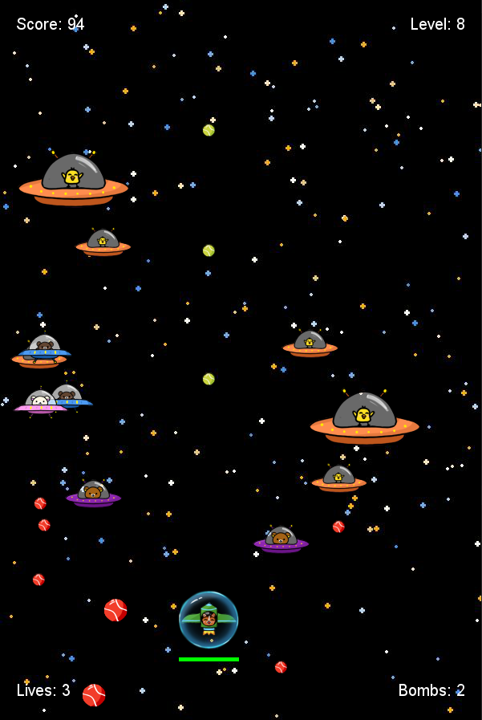

# SpaceShooter

### A classic space shoot'em up game made with python.

Current features include controllable player ship, menu options, randomly spawned enemies that shoot projectiles, four different power ups, and a moving background.

**How to play on your computer:**
Download the file from this repository
Make sure Python 3 is installed

Try to beat my highscore of 946!

**Planned future implementations:**
* Everchanging background
* Two player mode
* Boss Fight
